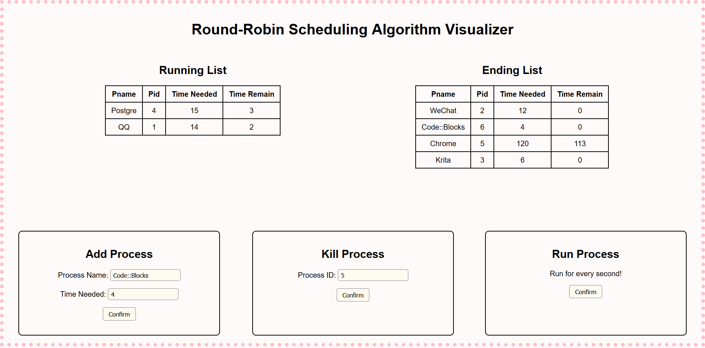
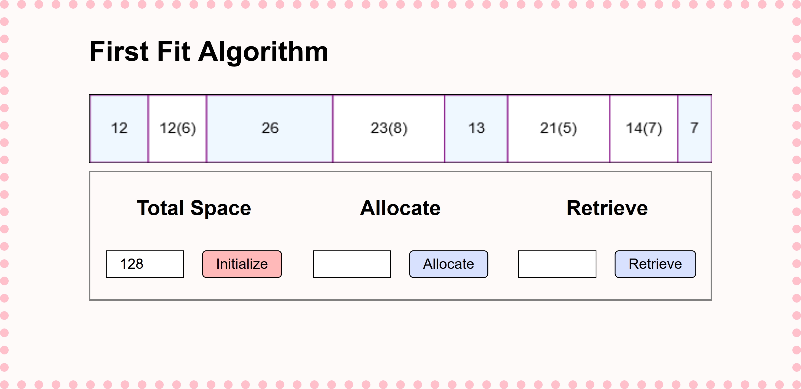
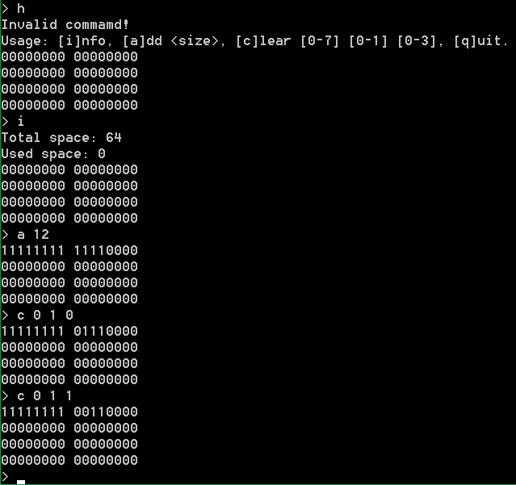
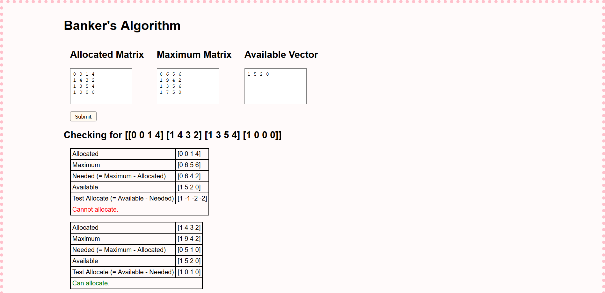
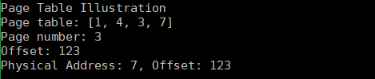

# oslab

_My Experiments of Operating System_

| Lab | Motif | UI | Written in |
| :- | :- | :- | :- |
| 1 | [Round-Robin Scheduling Algorithm](#round-robin-scheduling-algorithm) | [Web Page](https://chromezh.github.io/oslab/lab1/) | C++ |
| 2 | [First Fit Algorithm](#first-fit-algorithm) | [Web Page](https://chromezh.github.io/oslab/lab2/) | PureScript |
| 3 | [Bitmap](#bitmap) | Console | C++ |
| 4 | [Banker's Algorithm](#bankers-algorithm) | [Web Page](https://chromezh.github.io/oslab/lab4/) | PureScript |
| 5 | [Page Table Illustration](#page-table-illustration) | Console | Python |

## Round-Robin Scheduling Algorithm

[](lab1/)

### Design

* `State` field in PCB is redundant because:
  - Processes in state R are all in Running List
  - Processes in state E are all in Ending List
* The circular queue can be replaced by a circular linked list because:
  - A queue can be implemented by a linked list
  - Linked lists additionally support insert operation at a designated position, thus a newly inserted process can be run at once
* A circular linked list can be repalced by a single linked list because:
  - They provide the same access and modify operations
  - When iterating the single linked list, if the iterator reaches the end of the list, we can changed it to the front of the list to provide the same iteration behaviour as a circular linked list
* The fields `Time Needed` and `Time Elapsed` can be replaced by `Time Needed` and `Time Remain` because:
  - There is a simple relationship between them -- `Time Needed` = `Time Elapsed` + `Time Remain`
  - If we use `Time Remain`, we can easily know whether a process is ended by checking `Time Remain` = 0

### Features

* Use C++17 standard
* Use `std::forward_list` in STL as the circular queue
* Compile C++ to JavaScript to render UI in browser
* Add a kill process option

### Source Files

* `src/main.cpp`  -- PCB and its operations
* `index.html`  -- Web page for visualization
* `rr.css`  -- Stylesheet for HTML
* `rr.js` -- JavaScript code to operate and display PCB

### Build

Prerequisite: [Emscripten](http://emscripten.org/)

``` sh
$ em++ -Wall -Werror -std=c++17 -O --bind -o main.js src/main.cpp
```

### References

* [How do I efficiently remove_if only a single element from a forward_list?](https://stackoverflow.com/a/19375586)
* [Embind](http://kripken.github.io/emscripten-site/docs/porting/connecting_cpp_and_javascript/embind.html)

## First Fit Algorithm

[](lab2/)

### Design

* A `Block` represents a space in the memory with a certain size, which could be `Idle`, that has one attribute `len`, or be `Allocated`, that has two attributes `len` and `pid`
* The `Block`s are saved in a linked list
* The allocate operation can be handled by [pattern matching](https://en.wikipedia.org/wiki/Pattern_matching):
$allocate (p, l, list) =
\begin{cases}
\mathsf{Allocated} _ { len = x, pid = p } : xs& \left( list = \mathsf{Idle} _ { len = x } : xs, x = l \right) \\
\mathsf{Allocated} _ { len = l, pid = p } : \mathsf{Idle} _ { len = x - l } : xs& \left( list = \mathsf{Idle} _ { len = x } : xs, x > l \right)
\end{cases}$
* The retrieve operation can be handled by pattern matching:
$retrieve (p, list) =
\begin{cases}
\mathsf{Idle} _ { len = x + y + z } : xs& \left( list = \mathsf{Idle} _ { len = x } : \mathsf{Allocated} _ { len = y, pid = p' } : \mathsf{Idle} _ { len = z } : xs, p = p' \right) \\
\mathsf{Idle} _ { len = x + y } : xs& \left( list = \mathsf{Idle} _ { len = x } : \mathsf{Allocated} _ { len = y, pid = p' } : xs, p = p' \right) \\
\mathsf{Idle} _ { len = x + y } : xs& \left( list = \mathsf{Allocated} _ { len = x, pid = p' } : \mathsf{Idle} _ { len = y } : xs, p = p' \right) \\
\mathsf{Idle} _ { len = x } : xs& \left( list = \mathsf{Allocated} _ { len = x, pid = p' } : xs, p = p' \right)
\end{cases}$

### Features

* Use [PureScript](http://www.purescript.org/) and pattern matching
* Compile PureScript to JavaScript to render UI in browser

### Source Files

* `src/Main.purs`  -- Core library for initializing, allocating and retrieving
* `index.html`  -- Web page
* `ff.css`  -- Style sheet
* `ff.js`  -- JavaScript code to operate and display

### Build

Prerequisite: PureScript

``` sh
$ npm install -g purescript
$ npm install -g pulp bower
```

Once:

``` sh
$ bower install
```

Many times:

``` sh
$ pulp build --skip-entry-point --no-check-main -O --to main.js
```

## Bitmap



### Design

* The bitmap is stored as a "3-dimensional array" of `bool`. 0 for free and 1 for used
* When allocating, first checks whether there is enough space to allocate. If true, then allocate from the beginning
* When retrieving, finds the corresponding bit in the array and set it to 0
* Implements a simple text user interface and use regular expressions to recognize the commands

### Features

* Use C++17 standard
* Use regular expressions to recognize commands
* Use Makefile as the build tool

### Source File

* `bitmap.cpp`  -- Bitmap and its operations

### Build and Run

**Build**

Prerequisites: clang, make

``` sh
$ mingw32-make
```

**Run**

``` sh
$ ./bitmap.exe
```

## Banker's Algorithm

[](lab4/)

### Features

* Use PureScript
* Compile PureScript to JavaScript to render UI in browser
* Use Free Monad
* Generate HTML tags by combinators

### Source Files

* `src/Main.purs`  -- Core operations and UI rendering
* `index.html`  -- Web page
* `banker.css`  -- Style sheet

### Build

Prerequisite: [PureScript](http://www.purescript.org/)

``` sh
$ npm install -g purescript
$ npm install -g pulp bower
```

Once:

``` sh
$ bower install
```

Many times:

``` sh
$ pulp build --skip-entry-point --no-check-main -O --to main.js
```

### References

* [Banker's algorithm](https://en.wikipedia.org/wiki/Banker%27s_algorithm)
* [実例によるPureScript](https://aratama.github.io/purescript/purescript-book-ja)
* [Monad Transformers](http://dev.stephendiehl.com/hask/#monad-transformers)
* [What does Free buy us?](https://www.parsonsmatt.org/2017/09/22/what_does_free_buy_us.html)

## Page Table Illustration



### Features

* Use Python 3

### Source Files

* `paging.py`  -- Page table and its operations

### Run

``` sh
python paging.py
```
